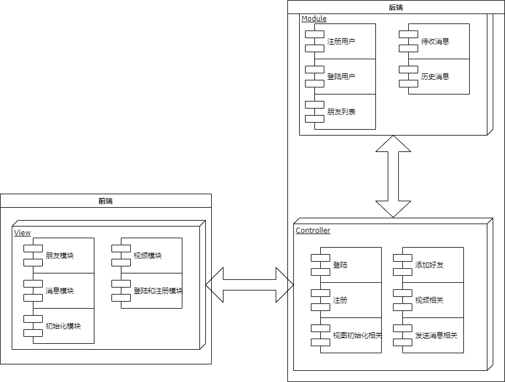

[TOC]

## 一、引言

### 1. 背景

实时聊天愈加火爆，但是网页版的实时聊天不多，并且很少有支持视频聊天功能的。

HTTPS协议使得消息可以在安全信道传输。

WebSocket使得浏览器也可以建立持久连接，使得频繁发送和接收消息的成本降低。

WebRTC协议是P2P协议，使得在传输视频数据时降低了服务器的压力，视频聊天便于实现。

### 2. 要求

界面友好，可扩展性强，稳定性强，并且要有一定的安全性

### 3. 目标

传输协议基于SSL，HTTP/1.1，WebSocket，WebRTC实现了一个简易的支持视频聊天、表情、图片的实时消息系统。

### 4. 相关介绍

1. base64

   用字符串代表二进制序列，4个字节可以代表二进制序列三个字节。

   用字符```ABCDEFGHIJKLMNOPQRSTUVWXYZabcdefghijklmnopqrstuvwxyz0123456789+/```代表0~63数字，如果二进制序列的字节数不是3的倍数，用0填充，base64序列用=填充。

   本项目的消息使用base64编码传输。

2. Http/1.1

   即超文本传输协议-版本1.1，允许发送流水线请求，并且相比Http1.0开销大大降低。

3. WebSocket

   WebSocket允许浏览器和服务器之间打开交互式通信会话(即持久化连接)，而无需通过轮询服务器以获得响应。

   本项目聊天部分用到了WebSocket。

4. WebRTC

   WebRTC(Web Real-Time Communications)是一种实时通信技术，它允许网络应用或者站点，不通过任何第三方媒介建立P2P连接，用以传输音频，视频等其它任何数据，减少服务器压力。

   本项目视频聊天功能用到了WebRTC。

5. SDP

   SDP(Session Description Protocol)是一个描述peer-to-peer连接的标准，SDP包含音视频的编解码，源地址，时间等信息。

   SDP也是WebRTC的组件之一，用于描述一个会话。

6. ICE

   ICE(Interactive Connectivity Establishment)是一个被WebRTC应用的框架，即使两端位于NAT后面，这个协议可以让两端互相找到对方并建立连接。

   ICE使用以下算法寻找最低等待时间路径去连接两端，通常为以下顺序

   1. 直接UDP连接
   2. 直接TCP连接(HTTP)
   3. 直接TCP连接(HTTPS)
   4. 间接通过中继器连接(存在位于防火墙后面的一方，无法进行NAT穿越)

7. 信令服务器

   WebRTC中交换视频请求和响应，交换ICE候选时用的服务器。服务器收到视频相关消息只是简单地转发它们，为两端建立连接提供信息。

8. STUN服务器

   通过STUN服务器，客户终端可以发现他们的IP地址，以及NAT相关信息，为NAT穿越提供信息。

## 二、需求分析

### 1. 业务调查

目前实时消息很火爆，但是网页的实时消息服务不多，支持视频聊天的又很少。

### 2. 系统的目标（含新系统的功能需求、性能需求、输入输出需求）

#### 2.1 功能需求

需要实现的功能

1. 发送和接收消息
2. 视频聊天
3. 好友系统，包括添加好友，好友列表
4. 登陆，注册系统

用例图如下


#### 2.2 性能需求

##### 实时性需求

1. 如果双方在线，发送消息延迟不应高于10秒
2. 视频延迟不应高于500ms

##### 安全性需求

1. 如果不知道用户的用户名和密码，则不能以他的身份发送消息或视频，或者迫使在线用户下线
2. 用户的用户名，密码，消息应该在安全信道传输

#### 2.3 输入输出需求

| 功能     | 输入                                 | 动作                                                         | 输出                             | 异常                                         |
| -------- | ------------------------------------ | ------------------------------------------------------------ | -------------------------------- | -------------------------------------------- |
| 添加朋友 | 朋友名                               | 把朋友关系写入朋友关系表                                     | 新的朋友列表                     | 朋友不存在<br>随机数验证失败                 |
| 发送消息 | 对方用户名<br>随机数<br>自己的用户名 | 如果对方在线就把消息转发给对方<br>如果对方不在线就存入待收消息表 | 新的消息列表<br>对方新的消息列表 | 随机数验证失败<br>对方不是朋友<br>对方不存在 |
| 视频邀请 | 对方用户名<br>随机数<br>自己的用户名 | 直接转发消息                                                 | 视频聊天                         | 随机数验证失败<br>对方不在线                 |
| 登陆     | 用户名，密码                         | 把登陆信息写入登陆表                                         | 会话凭证(随机数)                 | 用户名或密码错误                             |
| 注册     | 用户名，密码                         | 把注册信息写入注册信息表                                     | 注册成功/失败                    | 用户已存在                                   |

## 三、系统分析

### 1. 子系统划分

子系统划分如图


### 2. 系统业务流程


### 3. 系统数据流程

注册时的流程


登陆时的数据流程


添加朋友流程


发送消息流程


视频流程


### 4. 系统的数据字典

| 表项                  | 类型     | 范围                              |
| --------------------- | -------- | --------------------------------- |
| username              | 字符串   | 标识符                            |
| passwd                | 字符串   | 数字，字母，符号组成的序列        |
| id                    | 整数     | 0~2^63^-1的整数                   |
| message(存储的文件名) | 字符串   | 当前时间\|\|0~65535的十六进制整数 |
| message(实际消息)     | base64串 | 参见base64介绍                    |

## 四、系统设计

### 1. 系统配置设计

#### 1.1 硬件配置设计

- 服务器

  阿里云虚拟服务器

- 客户端

  满足基本网络通信要求的客户端

  需要带有摄像头，麦克风

#### 1.2 软件配置设计

- 服务器

  操作系统：Centos7.3

  服务器软件：Tomcat8.5

- 客户端

  Firefox 76.0.1

  Chrome76.0

  其它支持WebSocket，WebRTC，摄像头的浏览器

#### 1.3 网络配置设计

- 服务端

  开放8081端口

  - 由于阿里云有安全策略服务，所以服务器防火墙直接关掉即可

    ```shell
    # 关闭Firewall防火墙
    systemctl disable firewalld
    systemctl stop firewalld
    # 关闭iptables防火墙
    iptables -F
    iptables -X
    iptables -P INPUT ACCEPT
    iptables -P OUTPUT ACCEPT
    iptables -P FORWARD ACCEPT
    ```

  - 在阿里云安全策略中开放8081端口

  给8081端口支持SSL

  - 购买域名

  - 给域名申请免费证书

  - 在tomcat配置中添加如下配置信息

    ```xml
    <!--conf/server.xml-->
    <Connector port="8081"
                   protocol="HTTP/1.1"
                   SSLEnabled="true"
                    scheme="https"
                    secure="true"
                   clientAuth="false" 
                    keystoreFile="<path to cert>"
                    keystorePass="NVDNlti0"
                    ciphers="TLS_RSA_WITH_AES_128_CBC_SHA,TLS_RSA_WITH_AES_256_CBC_SHA,TLS_ECDHE_RSA_WITH_AES_128_CBC_SHA,TLS_ECDHE_RSA_WITH_AES_128_CBC_SHA256,TLS_RSA_WITH_AES_128_CBC_SHA256,TLS_RSA_WITH_AES_256_CBC_SHA256" />
    ```

  - 重启tomcat8

    ```shell
    sh tomcat8/bin/shutdown.sh
    sh tomcat8/bin/startup.sh
    ```

### 2. 程序数据结构设计

#### 2.1 后端的程序数据结构

1. WebSocket

   每一个登陆成功的用户，都对应着一个WebSocket类对象

   - user: 用户名
   - Session: 会话对象

2. Utility

   工具类，保存着数据库存储器对象，和一些常用函数

   - mFriendsRepo: 朋友数据库存储器对象
   - mMessageToReceiveRepo: 待收消息存储器对象
   - mHistoryMessageRepo: 历史消息存储器对象
   - mLoginUserRepo: 登陆用户存储器对象
   - mRegisterUserRepo: 注册用户存储器对象
   - DB_URL: 数据库连接地址
   - DB_PASS: 数据库密码
   - DB_USER: 数据库用户名

3. Friends

   对应于friends表

   - host：朋友中的一方
   - friend：朋友中的另一方

4. MessageToReceive

   对应于message_to_recieve表

   - id
   - sendUser: 发送者
   - receiveUser: 接收者
   - sendDate: 发送时间
   - msg: 消息内容(其实是保存消息内容的文件名)

5. HistoryMessage

   对应于history_message表

   - id
   - sendUser:发送者
   - receiveUser:接收者
   - sendDate: 发送时间
   - receiveDate: 接收时间
   - msg: 消息内容

6. LoginUser

   对应于login_user表

   - user: 用户名
   - rand: 随机数(用于验证)

7. RegisterUser

   对应于RegisterUser表

   - user: 用户名
   - registerDate: 注册日期
   - passwdHash: 密码

#### 2.2 前后端交互时使用的数据结构

使用JSON数据结构，在传输时有较小的体积，并且容易被人类读懂，到前端之后便于解析。

- 前端到后端的总体数据结构

  ```json
  {
      user:"",	// 用户名
      rand:"",	// 密码，用于验证
      to:"",		// 目的用户，如果是服务器则忽略此字段
      type:"",	// 消息类型
      date:"",	// 发送日期
      data:[]		// 数据，这个字段随着type字段的不同而不同
  }
  ```

  type可能取下面中的几个值中的一个

  1. request-friend-list

     获取朋友列表

  2. request-message-list

     获取待收消息列表，在登陆之后要做

  3. add-friend

     添加朋友，data为要添加的朋友

  4. message

     发送消息，data为要发送的消息内容

  5. video-offer

     提出视频请求，data为对应的sdp描述符

  6. video-answer

     提出视频回应，data为对应的sdp描述符

  7. new-ice-candidate

     交换ICE候选，data为ICE候选

  8. video-hang-up

     挂断视频

- 后端到前端的总体数据结构

  ```json
  {
      from:"",	// 在转发消息时，发送者的用户名
      type:"",	// 消息类型
      data:[]		// 数据，随着type字段不同而不同
  }
  ```

  type可能取下面中的几个值中的一个

  1. friend-list

     好友列表，data为所有好友用户名组成的数组

  2. message-list

     消息列表组成的数组，数组元素为消息对象

     ```json
     {
         from:"",	// 消息中的发送者
         msg:"",		// 消息内容
         date:"",	// 发送日期
     }
     ```

  3. add-friend

     添加朋友，data为朋友用户名

  4. message

     单条消息，data为消息对象的数组

  5. error

     错误，data为报错信息

  6. video-offer

     视频请求，data为sdp描述符

  7. video-answer

     视频回应，data为sdp描述符

  8. new-ice-candidate

     交换ICE候选，data为ICE候选

  9. video-hang-up

#### 2.3 前端数据结构

- info

  负责保存会话相关信息，做基础通讯

  1. ws: WebSocket对象
  2. user: 用户名
  3. rand: 会话凭证(随机数)
  4. videoCur: 当前视频聊天的人
  5. chatCur: 当前聊天的人

- message

  负责发送单条消息

  1. msg: 发送消息框对象，用于获取消息文本

- messageList

  负责管理消息列表，保存历史消息，把消息添加进视图，以及有视频时界面的排版

  1. list: 消息列表的视图对象

  2. target: 当前聊天用户

  3. main: 消息列表容器的视图对象

  4. msgs: 保存当前会话所有历史消息，格式如下

     ```json
     {
         "username1":[	//和username1的聊天记录
             {
                 from:"",	// 发送者，是username还是用户
                 msg:"",
                 date:""
             },
             //... 可能有很多条消息
         ],
         "username2":[
             {
                 from:"",
                 msg:"",
                 date:""
             }
         ],
         //...
     }
     ```

- friends

  保存朋友有关信息，管理朋友视图

  1. list: 朋友的用户名列表
  2. listView: 朋友列表视图
  3. search: 朋友搜索框视图对象

- button

  负责按钮的监听器初始化操作

- emotion

  负责表情视图的显示和隐藏，以及表情的选择，添加等

  1. v: 表情视图可见性
  2. e: 表情视图对应的视图对象

- video

  负责视频的初始化，连接，挂断，视频视图的控制

  1. target: 视频通话的对方用户名
  2. selfPreview: 本地视频预览框对应的视图对象
  3. targetPlayer: 对方视频的播放框
  4. peerConnection: RTCPeerConnection对象
  5. windows: 视频预览框容器，控制视频视图显示和隐藏时候用
  6. localStream: 本地视频流

### 3. 系统结构设计

采用了MVC框架

后端主要负责M(model)，和C(control)，M对应着数据，C对应着业务逻辑

前端主要负责V(View)，包括视图的控制，和后端的数据交互，视图的更新

结构图如下



### 4. 系统功能模块设计

#### 4.1 登陆注册模块

1. 注册

   - 前端

     用户输入用户名和密码，前端会获取用户输入，之后通过AJAX，以POST方式把消息发往服务器。之后获取服务器返回的结果，并且将结果显示给用户。

     ```javascript
     register() {
           let userName = this.form.name;
           let password = this.form.password;
           xmlHttp = new XMLHttpRequest();
     
           xmlHttp.onreadystatechange = function () {
             if (xmlHttp.readyState == 4 && xmlHttp.status == 200) {
               console.log(xmlHttp.responseText);
               let obj = JSON.parse(xmlHttp.responseText);
               console.log(obj);
               vm.info.title_info=obj.type;
               vm.info.login_register_info=obj.data[0];
               vm.info.visible=true;
             }
           }
     
           xmlHttp.open("POST", "/chat/register_control", true);
           xmlHttp.setRequestHeader("Content-type","application/x-www-form-urlencoded");
           xmlHttp.send("username=" + userName + "&password="+password);
         }
       }
     ```

   - 后端

     后端收到前端发来的请求后，会首先检查用户是否存在，如果不存在则将用户的注册信息存入数据库。并且返回一个结果。

     ```java
     List<RegisterUser> userNameUsers = Utility.getmRegisterUserRepo().findByUserName(username);
     		if(userNameUsers.size()!=0) {
     			obj.put("type","error");
     			ja.add("Failed, \""+username+"\"existed!!!");
     			obj.put("data", ja);
     		}else {
     			
     			RegisterUser ru = new RegisterUser();
     			ru.setUserName(username);
     			ru.setPasswdHash(password);
     			Date rd = new Date();
     			ru.setRegisterTime(rd);
     			Utility.getmRegisterUserRepo().save(ru);
     
     			log.info(username+password+" Saved at "+rd.toString());
     			obj.put("type","success");
     			ja.add("Register Successful");
     			obj.put("data",ja);
     		}
     ```

2. 登陆

   - 前端

     获取用户名和密码，然后发送给后端。和注册的原理基本相同。

     但是收到返回的结果后，如果是成功的则需要把用户名和随机数存入会话存储，然后跳转到聊天页面。

     ```javascript
     if(obj.type=="success"){
                 sessionStorage.setItem("user",userName);
                 let data = obj.data;
                 let rand = data[0];
                 sessionStorage.setItem("rand",rand);
                 window.location.href="../index.html";
               }
     ```

   - 后端

     后端需要先检查用户名和密码是否合法，如果合法才进一步操作。

     然后检查用户是否已经登陆，如果已经登陆则应该删除用户的登陆信息，然后写入新的用户登陆信息。并且需要给前端返回新的随机数。

     ```java
     List<RegisterUser> rus = Utility.getmRegisterUserRepo().findByUserName(username);
     		if(rus.size()==0||!rus.get(0).getPasswdHash().equals(password)) {
     			obj.put("type","error");
     			ja.add("username or password wrong");
     		}else {
     			
     
     			int rand = (int)(Math.random()*Integer.MAX_VALUE);
     			ru = rus.get(0);
     			LoginUser lu = new LoginUser();
     			lu.setId(ru.getId());
     			lu.setUserName(username);
     			lu.setRand(rand);
     			Utility.getmLoginUserRepo().save(lu);
     			log.info("login from "+ru.getUserName());
     			obj.put("type","success");
     			ja.add(""+rand);
     		}
     ```

#### 4.2 刷新朋友列表和消息列表

登陆成功后，会首先获取存储在会话存储中的用户名和随机数，然后开启WebSocket连接

```javascript
info.user = sessionStorage.getItem("user");
		info.rand = sessionStorage.getItem("rand");
		info.ws = new WebSocket("wss://<Server domain name:port>/chat/ws/" + info.user);
```

之后会发送获取朋友列表和消息列表的请求的请求

```javascript
info.ws.onopen = function () {
			console.log("Websocket connect successfuly");
			info.to = info.user;
			friends.getFriendList();
			messageList.getMessageList();
		}
```

后端收到该请求后，会查询数据库，然后把结果返回

```java
public void sendFriendList(JSONObject uObj) {
		if(!vertifyRand(uObj.getString("user"),uObj.getString("rand"))) {
			sendError("Rand Vertify failed");
			return;
		}
		JSONObject obj = new JSONObject();
		List<Friends> fl = mFriendsRepository.findByFriend(user);
		JSONArray ja = new JSONArray();
		
		for (Friends f : fl) {
			ja.add(f.getFriend());
		}
		obj.put("type","friend-list");
		obj.put("data",ja);
		send(obj.toString());
	}
public void sendToReceiveMessageList(String user) {
		JSONObject obj = new JSONObject();
		List<MessageToReceive> mtrs = mMessageToReceiveRepo.findByReceiveUser(user);
		JSONArray ja = new JSONArray();
		for(MessageToReceive mtr:mtrs) {
			JSONObject mtrObj = new JSONObject();
			mtrObj.put("from",mtr.getSendUser());
			mtrObj.put("msg",mtr.getMessage());
			mtrObj.put("date",mtr.getDate().toString());
			ja.add(mtrObj);
			
			HistoryMessage hm = new HistoryMessage();
			hm.setId(mHistoryMessageRepo.selectMaxId()+1);
			hm.setMessage(mtr.getMessage());
			hm.setReadDate(new Date());
			hm.setSendDate(mtr.getDate());
			hm.setReceiveUser(mtr.getReceiveUser());
			hm.setSendUser(mtr.getSendUser());
			mHistoryMessageRepo.save(hm);
			mMessageToReceiveRepo.deleteById(mtr.getId());
		}
		obj.put("type", "message-list");
		obj.put("data",ja);
		send(obj.toString());
	}
```

前端收到后端发来的消息后，会存储并解析数据，然后显示在视图中

```javascript
case "friend-list":
				friends.list = obj.data;
				friends.refresh();
				break;
case "message-list":
				messageList.receiveMessageList(obj.data);
				break;
```

#### 4.3 发送和接收消息模块

由于WebSocket是持久化连接，所以后端收到消息后，如果对方在线，则直接发送；如果对方不在线，应该把消息存入待收消息列表，等用户登陆后在把消息发给对方。

其中还有验证随机数，验证双方是否是朋友，验证对方是否存在的操作。

```java
if(mWebSocketMap.containsKey(to)) {
			JSONObject msgObj = new JSONObject();
			msgObj.put("from",user);
			msgObj.put("msg",message);
			msgObj.put("date",new Date().toString());
//			System.out.println(msgObj);
			
			JSONObject toObj = new JSONObject();
			toObj.put("from",user);
			toObj.put("type","message");
			ja = new JSONArray();
			ja.add(msgObj);
			toObj.put("data",ja);
			mWebSocketMap.get(to).send(toObj.toString());
			
			HistoryMessage hm = new HistoryMessage();
			hm.setId(mHistoryMessageRepo.selectMaxId()+1);
			hm.setMessage(message);
			hm.setSendDate(new Date());
			hm.setReadDate(new Date());
			hm.setReceiveUser(to);
			hm.setSendUser(user);
			mHistoryMessageRepo.save(hm);
		}else {
			MessageToReceive mtr = new MessageToReceive();
			mtr.setDate(new Date());
			mtr.setId(mMessageToReceiveRepo.selectMaxId()+1);
			mtr.setReceiveUser(to);
			mtr.setSendUser(user);
			mtr.setMessage(message);
			mMessageToReceiveRepo.save(mtr);
		}
```

#### 4.4 朋友模块

和发送消息模块大致相同，如果对方在线就把朋友请求发送给对方，对方的前端视图更新朋友列表；如果不在线就存入朋友列表，下次对方登陆获取朋友列表时，就能获取到新朋友。

#### 4.5 视频模块

尝试过两种实现方案

- 第一种是通过WebSocket的方式，前端每隔0.5秒获取一次用户视频的一帧，然后发送给服务器。服务器直接转发流量。

  获取用户摄像头

  ```javascript
  navigator.mediaDevices.getUserMedia(video.mediaConstraints)
  			.then(function (localStream) {
  				video.selfPreview.srcObject = localStream;
      			video.localStream = localStream;
      			video.startSending();
  			})
  ```

  使用canvas每个0.5s获取摄像头的照片，并且转化为base64编码

  ```javascript
  let can = document.createElement("canvas");
  let context = can.getContext("2d");
  await context.drawImage(video.localStream,0,0,320,320);
  let imgBase64 = context.toDateURL("image/png");
  ```

  发送给服务器

  ```javascript
  info.send({
      user:info.user,
      type:"video",
      rand:info.rand,
      to:video.target,
      data:[imgBase64]
  });
  ```

  对方收到之后，把数据绘制在canvas中

  ```javascript
  let ctx = video.targetCanvas.getContext();
  ctx.drawImage(imgBase64,320,320);
  ```

  其中还有设置定时器等细节。

  但是这种方式会使服务器由于频繁转发流量而CPU跑满，并且视频卡顿严重，所以是用第二种方式

- 第二种是通过WebRTC的方式，通过STUN服务器获取双方的IP地址，然后直接以P2P的方式，不通过服务器进行视频聊天。期间双方会协商各种参数。

  假设A端是视频发起者，B端是视频应答者

  在建立视频连接的过程中，服务器只是简单地转发消息

  1. A获取用户摄像头，然后把流添加到本地和RTCPeerConnection

     ```javascript
     video.createRtcPeerConnection();
     
     		navigator.mediaDevices.getUserMedia(video.mediaConstraints)
     			.then(function (localStream) {
     				video.selfPreview.srcObject = localStream;
     				video.peerConnection.addStream(localStream);
     			})
     			.catch(video.handleGetUserMediaError);
     ```

  2. 创建好RTCPeerConnection后，先设置本地描述符

     然后A给B发送video-offer消息，携带SDP到B端

     ```javascript
     video.peerConnection.createOffer().then(function (offer) {
     			video.peerConnection.setLocalDescription(offer)
     		}).then(function () {
     			info.send({
     				user: info.user,
     				type: "video-offer",
     				rand: info.rand,
     				to: video.target,
     				data: [{
     					sdp: video.peerConnection.localDescription
     				}]
     			})
     		})
     ```

  3. B收到video-offer之后，需要设置远端SDP(即A的SDP)

     获取用户摄像头，并且添加视频流，设置本地预览流

     创建一个本地SDP，回应一个video-answer消息，并携带本地SDP到A

     ```javascript
     video.target = msg.from;
     		video.showWindow();
     		targetUsername = msg.from;
     		video.createRtcPeerConnection();
     
     		let desc = new RTCSessionDescription(msg.data[0].sdp);				video.peerConnection.setRemoteDescription(desc).then(function () {
     				return navigator.mediaDevices.getUserMedia(video.mediaConstraints);
     			})
     			.then(function (stream) {
     				video.localStream = stream;
     				video.selfPreview.srcObject = video.localStream;
     				video.localStream.getTracks().forEach(track => video.peerConnection.addTrack(track, video.localStream));
     			})
     			.then(function () {
     				return video.peerConnection.createAnswer();
     			})
     			.then(function (answer) {
     				return video.peerConnection.setLocalDescription(answer);
     			})
     			.then(function () {
     				let msg = {
     					user: info.user,
     					to: video.target,
     					type: "video-answer",
     					rand: info.rand,
     					data: [{
     						sdp: video.peerConnection.localDescription
     					}]
     				};
     
     				info.send(msg);
     			})
     			.catch(video.handleGetUserMediaError);
     ```

  4. A收到video-answer之后，需要设置远端SDP(即B端SDP)

     ```javascript
     let desc = new RTCSessionDescription(msg.data[0].sdp);
     		console.log(desc);
     		await video.peerConnection.setRemoteDescription(desc).catch(video.reportError);
     ```

  5. 之后A和B就会开始不断地交换ICE候选，直到选出最适合的ICE候选

     发送ICE候选

     ```javascript
     info.send({
     				user: info.user,
     				type: "new-ice-candidate",
     				rand: info.rand,
     				to: video.target,
     				data: [{
     					candidate: event.candidate
     				}]
     
     			});
     ```

     接收ICE候选

     ```javascript
     if (msg.data[0].candidate != null) {
     
     			let candidate = new RTCIceCandidate(msg.data[0].candidate);
     			console.log(candidate);
     			video.peerConnection.addIceCandidate(candidate)
     				.catch(video.reportError);
     		}
     ```

  6. 一旦选出了最适合的ICE候选，双方就把视频流添加到视频显示框，然后开始视频通话

     ```javascript
     video.targetPlayer.srcObject = event.streams[0];
     ```

     但是ICE候选的交互并没有就此结束，如果后续找到更好的ICE候选，则会使用新的ICE候选

     如果通讯情况恶化，也会触发新的ICE候选交换

  7. 挂断

     设A主动挂断视频

     A要给B发送一个挂断信号(通过服务器)

     ```javascript
     info.send({
     			user: info.user,
     			to: video.target,
     			rand: info.rand,
     			type: "hang-up-video"
     		});
     ```

     然后进行WebRTC中的挂断操作

     ```javascript
     video.hideWindow();
     		let remoteVideo = video.targetPlayer;
     		let localVideo = video.selfPreview;
     		// 清除RTCPeerConnection对象
     		if (video.peerConnection) {
     			video.peerConnection.ontrack = null;
     			video.peerConnection.onremovetrack = null;
     			video.peerConnection.onremovestream = null;
     			video.peerConnection.onicecandidate = null;
     			video.peerConnection.oniceconnectionstatechange = null;
     			video.peerConnection.onsignalingstatechange = null;
     			video.peerConnection.onicegatheringstatechange = null;
     			video.peerConnection.onnegotiationneeded = null;
     			// 停止各个轨道
     			if (remoteVideo.srcObject) {
     				remoteVideo.srcObject.getTracks().forEach(track => track.stop());
     			}
     
     			if (localVideo.srcObject) {
     				localVideo.srcObject.getTracks().forEach(track => track.stop());
     			}
     
     			video.peerConnection.close();
     			video.peerConnection = null;
     		}
     		// 清除视频框中的视频流
     		remoteVideo.removeAttribute("src");
     		remoteVideo.removeAttribute("srcObject");
     		localVideo.removeAttribute("src");
     		remoteVideo.removeAttribute("srcObject");
     ```

  至此，一个视频通话就完成了。

### 5. 编码设计

发送消息时，为了解决中文编码，图片，表情的问题，采用了base64编码，保证发送端和接收端收到的二进制序列都是一样的。

### 6. 数据库设计

ER图如图


由ER图可以设计出以下5张数据表

####　6.1 注册用户表

- id ：在数据库中标识一个用户的唯一整数
- 用户名：用户注册时的唯一标识
- 密码
- 注册时间

#### 6.2 登录用户表

- id：对应于注册用户表中的id
- 用户名
- 用户的会话凭证(随机数)

#### 6.3 待收消息表

- id：用于标识每一条消息的唯一id
- 发送者
- 接受者
- 消息内容
- 发送时间

#### 6.4 历史消息表

- id：用于标识历史消息中的唯一一条消息
- 发送者
- 接受者
- 消息内容
- 发送时间
- 接收时间

#### 6.5 朋友关系表

- host：朋友中的一方
- friend：朋友中的另一方

## 五、系统测试

### 1. 功能性测试


注册


登陆


发送消息


表情和图片


视频(本实例中都是自己的摄像头)


### 2. 安全性测试

图中更改了发送消息中随机数的值导致验证失败，说明如果不知道一个用户的密码或随机数，则无法以他的身份发送消息。


## 六、课程设计总结

本项目基于WebRTC，WebSocket实现了一个聊天系统。

## 参考资料

1. [Vue文档](https://cn.vuejs.org/)
2. [Element-ui文档](https://element.eleme.cn/#/zh-CN/component/installation)
3. [Servlet--菜鸟教程](https://www.runoob.com/servlet/servlet-tutorial.html)
4. [WebSocket客户端--MDN](https://developer.mozilla.org/zh-CN/docs/Web/API/WebSocket)
5. [WebSocket服务器端--MDN](https://developer.mozilla.org/zh-CN/docs/Web/API/WebSockets_API/Writing_a_WebSocket_server_in_Java)
6. [WebRTC--MDN](https://developer.mozilla.org/zh-CN/docs/Web/API/WebRTC_API)
7. [JavaScript--MDN](https://developer.mozilla.org/zh-CN/docs/Web/JavaScript/Reference)
8. [Ajax--MDN](https://developer.mozilla.org/zh-CN/docs/Web/Guide/AJAX)

##　附件说明

chat-src/---------源代码文件夹

chat-exe/--------可执行程序文件夹

设计报告.pdf---本文件

录屏.mp4---------使用示例